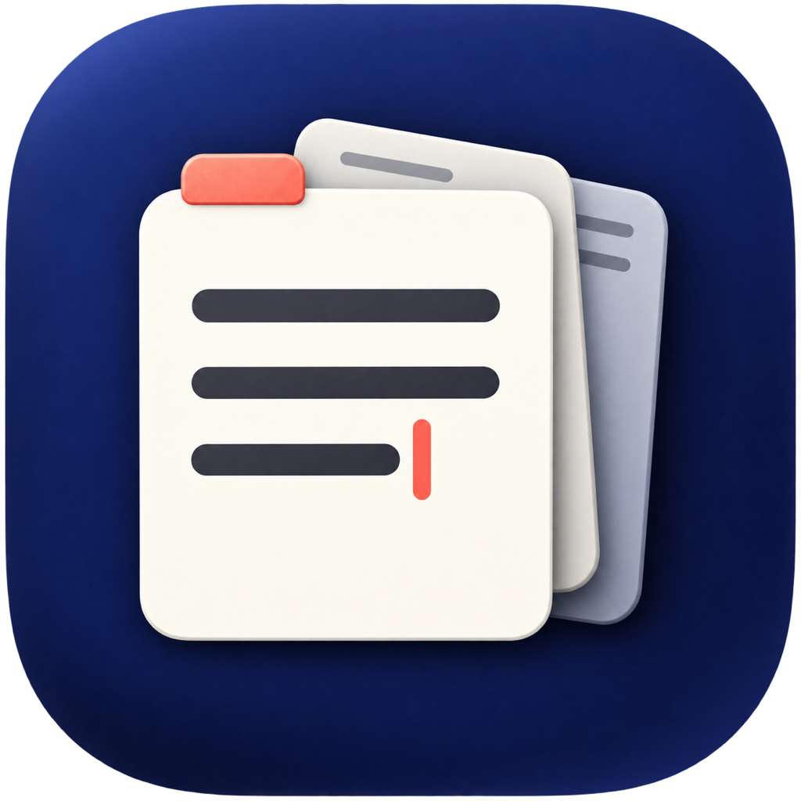

<p align="center">
  
</p>

<h1 align="center">Script App · 草稿本</h1>

<p align="center">一个轻量、始终在手边的 macOS 临时草稿本。</p>

草稿本适合临时保存一段文字、边看视频边记笔记、打磨微信或邮件草稿，以及放置几天后就不再需要的信息。它不是知识库，也不要求你为每条内容创建标题和文件夹；打开就写，用完再处理。

> 当前为 `0.9.0 Public Beta`。安装包尚未使用 Apple Developer ID 签名，也未经过 Apple 公证。请先阅读[首次打开说明](docs/INSTALL.md)。

## 下载

前往 [GitHub Releases](https://github.com/hy198619/script-app/releases) 下载最新公开测试版：

```text
Script-App-DraftBook-v0.9.0-macOS-unsigned.dmg
```

系统要求：macOS 14 Sonoma 或更高版本，支持 Apple Silicon 与 Intel Mac。

每个 Release 同时提供 `SHA256SUMS.txt`。首次打开需要在 `系统设置 → 隐私与安全性` 中选择“仍要打开”，完整步骤见[安装说明](docs/INSTALL.md)。

## 核心特点

- 打开窗口即可输入，不需要先创建文档；
- `⌘↩︎` 划定当前草稿，新内容始终在最上方；
- 自动保存，重启后恢复未划定和已划定内容；
- 每条草稿可独立切换 Markdown；
- 彩色标签兼具分类与时间褪色提示；
- 全文搜索，并可只看某个颜色标签；
- 到期草稿进入清理台，可延期、固定、存档或删除；
- 回收站支持恢复和永久删除；
- TXT、Markdown、完整 JSON 导出；
- 每日自动备份，支持从完整备份恢复；
- 可调默认清理周期、备份策略和窗口置顶；
- 完全本地运行，不需要账号，没有网络请求。

## 基本使用

1. 在窗口最上方直接输入；
2. 按 `⌘↩︎` 完成这一段，继续写下一段；
3. 点击彩色草稿签更换标签颜色；
4. 鼠标悬停在草稿上方，可复制、固定、切换 Markdown、存档或删除；
5. 到期内容会显示“待处理”，在清理台决定它的去留；
6. 按 `⌘,` 打开设置。

软件内置“功能示例与说明”，可以一键添加七种状态的示例草稿，实际体验清理、存档和回收流程。

## 数据与隐私

所有草稿都保存在本机：

```text
~/Library/Application Support/com.yangyuxuan.DraftBook/
```

当前版本不包含账号、云同步、分析统计、广告 SDK 或网络上传。草稿文件目前没有加密，因此不要把它当作密码管理器，也不建议长期保存密码、私钥或恢复码。详见[隐私说明](docs/PRIVACY.md)。

## 反馈

请通过 [GitHub Issues](https://github.com/hy198619/script-app/issues) 报告问题或提出建议。建议先阅读[反馈指南](docs/FEEDBACK.md)，不要在 Issue 或截图中泄露真实草稿和账号信息。

## 从源码构建

需要 Xcode 16.2 或兼容的更新版本。

```bash
swift test
./scripts/build-app.sh
```

生成的应用位于：

```text
dist/草稿本.app
```

生成未公证的公开测试 DMG：

```bash
./scripts/package-unsigned-beta.sh
```

## 项目状态

当前版本已经覆盖核心使用闭环，但仍属于公开测试：

- 尚未使用 Developer ID 签名和 Apple 公证；
- 暂无云同步、全局呼出快捷键和自动更新；
- 数据尚未加密；
- 目前最低支持 macOS 14。

更新记录见 [CHANGELOG.md](CHANGELOG.md)，参与开发见 [CONTRIBUTING.md](CONTRIBUTING.md)。

## 许可

本项目采用 [PolyForm Perimeter License 1.0.1](LICENSE.md)，属于 **Source Available（源码可见）**，不是 OSI 定义下的开源协议。

你可以使用、查看、修改和分发代码，但不得利用本软件向他人提供与草稿本竞争的产品。作者保留未来商业化、闭源版本、收费功能和另行授权的权利。正式条款以 `LICENSE.md` 为准。

Required Notice: Copyright © 2026 杨昱轩.
